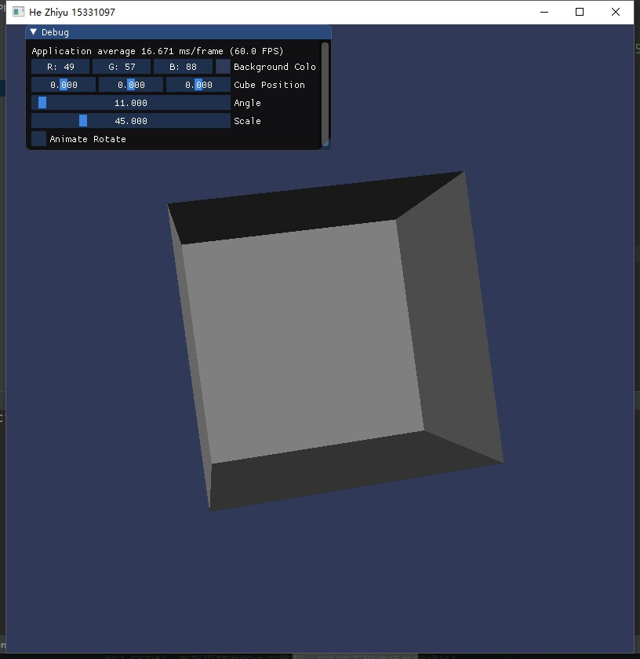
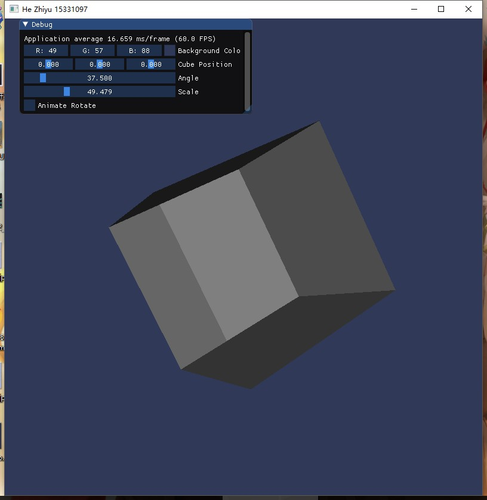
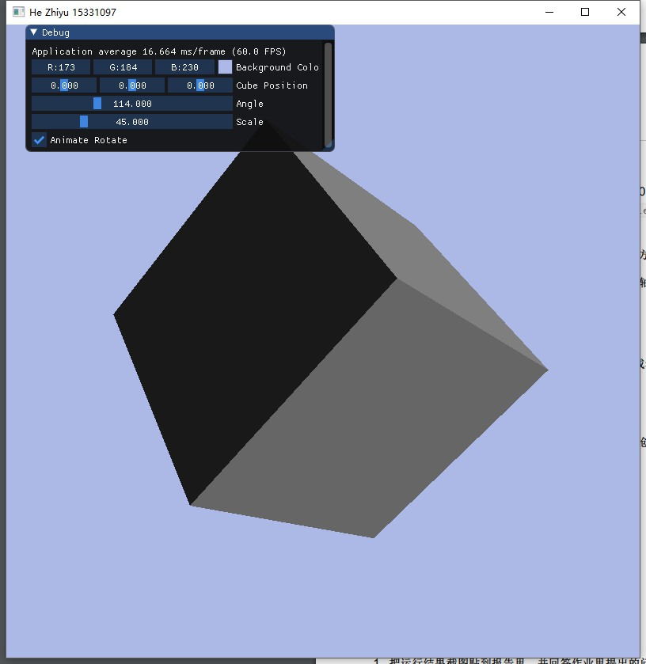
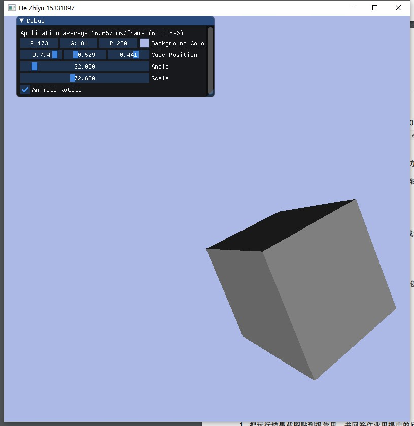
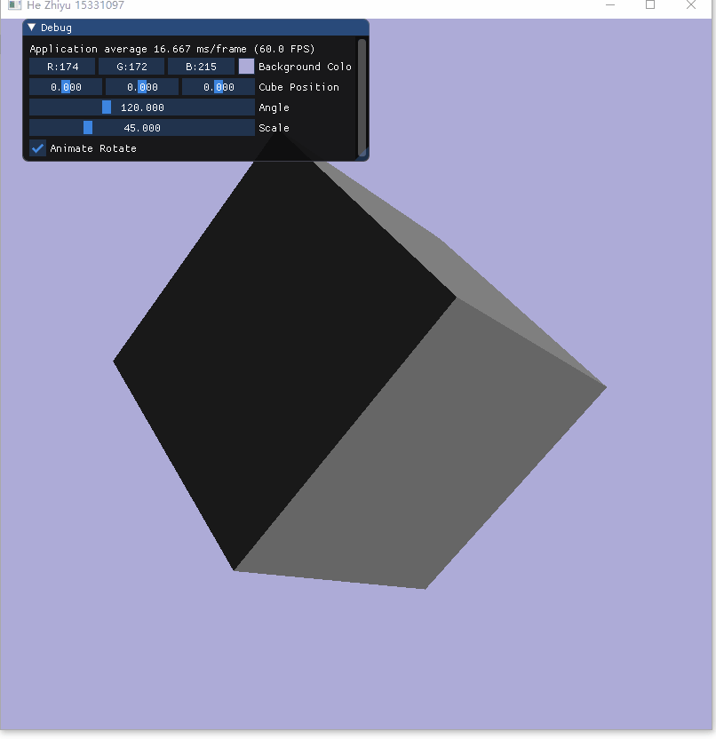

# CG - HW4 - Transformation

15331097, 何志宇

## 如何运行

windows环境下，打开./cmake-build-debug/hw3.exe即可运行。若无此文件夹。可以根据CMakeLists.txt直接编译即可。

## 1. 画一个立方体(cube)：边长为0.4， 中心位置为(0, 0, 0)。分别启动和关闭深度测试 `glEnable(GL_DEPTH_TEST)` 、 `glDisable(GL_DEPTH_TEST)` ，查看区别，并分析原因。

- 未开启深度测试




- 开启深度测试




可以发现，深度测试主要是负责和控制各个图片层前后覆盖的位置关系。
经过查阅资料得知：深度值存储在每个片段里面（作为片段的z值），当片段想要输出它的颜色时，OpenGL会将它的深度值和z缓冲进行比较，如果当前的片段在其它片段之后，它将会被丢弃，否则将会覆盖。

## 2. 平移、旋转、缩放

见[GIF Demo](./Animation.gif)


## 实现思路

通过绘制三角形来拼接成立方体，需要的顶点数为`6 * 2 * 3 = 36`个顶点。

每个顶点的格式为位置+颜色，数据格式为`[x, y, z, r, g, b]`。

透视矩阵和视图矩阵，控制立方体的缩放
```cpp
projection = glm::perspective(glm::radians(scale), (float) SCREEN_WIDTH / (float) SCREEN_HEIGHT, 0.1f, 100.0f);
view = glm::translate(view, glm::vec3(0.0f, 0.0f, -3.0f));
```

模型矩阵，控制立方体的位置和旋转角度
```cpp
glm::mat4 model;
model = glm::translate(model, cubePosition);
model = glm::rotate(model, glm::radians(angle), glm::vec3(0.0f, 1.0f, 1.0f));
```

而且一个顶点坐标会被变换道裁剪坐标：
```
V_clip = M_projection ⋅ M_view ⋅ M_model ⋅ V_local
```

最后在主循环里用`ImGui`控制各个向量和标量已达到可以控制立方体各种操作变换。