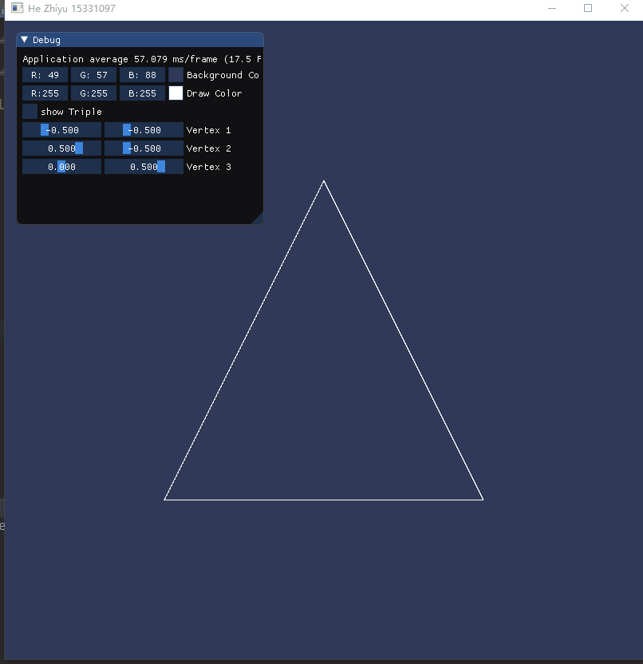

# CG - HW3 - Draw line

15331097, 何志宇

## 如何运行

`windows`环境下，打开`./cmake-build-debug/hw3.exe`即可运行。若无此文件夹。可以根据`CMakeLists.txt`直接编译即可。

## 1. 把运行结果截图贴到报告里，并回答作业里提出的问题。



## 2. 报告里简要说明实现思路，以及主要function/algorithm的解释。

### 核心思想

按直线从起点到终点的顺序计算直线各垂直网格线的交点，然后确定该列像素中与此交点最近的像素。

### 核心代码

- 直线

```cpp
    do {
        this->addPoints(pixi,
                        isKBiggerThan1 ? y : x,
                        isKBiggerThan1 ? x : y);
        pointCounter++;

        if (p < 0) {
            p += 2 * dy;
        } else {
            y += cy;
            p += 2 * (dy - dx);
        }

        x += cx;
    } while (x <= x1);
```

其中变量`p`代表着该点到上一个网格点和下一个网格点中的偏差，通过符号来进行判断是取上点还是下点。

- 圆

```cpp
    do {
        this->addPoints(pixi, x0 - x, y0 + y); // 第一象限, 初值为最右的一点, 向上拓展
        this->addPoints(pixi, x0 - y, y0 - x); // 第二象限, 初值为最上一点, 向左拓展
        this->addPoints(pixi, x0 + x, y0 - y); // 第三象限, 初值为最左一点, 向下拓展
        this->addPoints(pixi, x0 + y, y0 + x); // 第四象限, 初值为最下一点, 向右拓展
        pointCounter += 4;

        int currentError = error;
        if (currentError <= y) {
            y++;
            error += 2 * y + 1;
        }

        if (currentError > x || currentError > y) {
            x++;
            error += 2 * x + 1;
        }
    } while (x < 0);
```

通过圆的定义方程，对每一个象限进行分别处理，也就是带入圆的方程然后通过判断符号来决定取上点还是取下点。